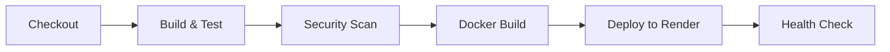

# CI/CD Workflows - GitHub Actions

Conjunto de workflows automatizados que implementan un pipeline DevOps completo para integración continua, escaneo de seguridad, construcción de imágenes Docker y despliegue.

## 📋 Descripción

Este directorio contiene **8 workflows de GitHub Actions** que se ejecutan automáticamente en diferentes eventos del repositorio (push, pull request, schedule) para garantizar calidad, seguridad y despliegue continuo.

## 🔄 Workflows Disponibles

### 1. `ci.yml` - Continuous Integration

**Propósito**: Pipeline básico de CI para validar código en cada push/PR

**Triggers**:
- Push a rama `main`
- Pull Requests a `main`

**Jobs**:
```yaml
- checkout: Clona el repositorio
- setup-node: Configura Node.js 18
- install-deps: npm install en backend y frontend
- lint: Ejecuta linters (ESLint)
- test: Corre suite de tests unitarios
- build: Construye aplicaciones
```

**Duración aproximada**: 3-5 minutos

**Uso**: Asegura que cada cambio pase tests antes de merge

---

### 2. `docker-build.yml` - Docker Image Build

**Propósito**: Construir y pushear imágenes Docker a Docker Hub

**Triggers**:
- Push a `main` con cambios en `backend/` o `frontend/`
- Manual dispatch

**Jobs**:
```yaml
- build-backend:
  - Login a Docker Hub
  - Build multi-stage Dockerfile
  - Tag: latest + SHA commit
  - Push a leonardpeace/crud-backend

- build-frontend:
  - Build imagen React optimizada
  - Tag con versión semántica
  - Push a leonardpeace/crud-frontend
```

**Secrets requeridos**:
- `DOCKERHUB_USERNAME`
- `DOCKERHUB_TOKEN`

**Duración aproximada**: 5-8 minutos

---

### 3. `complete-pipeline.yml` - End-to-End Pipeline

**Propósito**: Workflow completo que combina build, test, security y deploy

**Triggers**:
- Push a `main`
- Schedule: Diariamente a las 2 AM UTC

**Jobs** (en secuencia):


1. **build-and-test**: CI completo
2. **security-scan**: Trivy + CodeQL
3. **docker**: Build imágenes
4. **deploy**: Trigger Render deployment
5. **verify**: Health check POST-deploy

**Duración aproximada**: 15-20 minutos

---

### 4. `codeql.yml` - Code Security Analysis

**Propósito**: Análisis estático de código con GitHub CodeQL

**Triggers**:
- Push a `main`
- Pull Requests
- Schedule: Lunes a las 6 AM UTC

**Lenguajes analizados**:
- JavaScript/TypeScript

**Checks**:
- ✅ Inyección SQL
- ✅ XSS (Cross-Site Scripting)
- ✅ Path traversal
- ✅ Hardcoded secrets
- ✅ Command injection

**Resultados**: Visibles en **Security → Code scanning alerts**

**Duración aproximada**: 2-4 minutos

---

### 5. `zap-scan.yml` - OWASP ZAP Security Scan

**Propósito**: Escaneo de vulnerabilidades web con OWASP ZAP

**Triggers**:
- Schedule: Semanalmente (Domingos 3 AM UTC)
- Manual dispatch

**Target**: `https://crud-backend-1o29.onrender.com`

**Tipos de escaneo**:
- **Baseline Scan**: Escaneo pasivo rápido
- **Full Scan**: Escaneo activo completo (manual)

**Vulnerabilidades detectadas**:
- SQL Injection
- XSS
- CSRF
- Insecure headers
- SSL/TLS issues

**Reporte**: Generado en `zap-report.html` (artifact)

**Duración aproximada**: 5-10 minutos (baseline) / 30-60 min (full)

---

### 6. `trivy-scan.yml` - Container Security Scan

**Propósito**: Escanear imágenes Docker por vulnerabilidades conocidas (CVEs)

**Triggers**:
- Push que modifique Dockerfiles
- Schedule: Diariamente a las 4 AM UTC
- Manual dispatch

**Escanea**:
- `leonardpeace/crud-backend:latest`
- `leonardpeace/crud-frontend:latest`

**Severity levels**:
- 🔴 CRITICAL
- 🟠 HIGH
- 🟡 MEDIUM
- 🟢 LOW

**Acción en falla**:
```yaml
# Falla el workflow si hay CVEs CRITICAL/HIGH
exit-code: 1
severity: 'CRITICAL,HIGH'
```

**Reporte**: JSON + SARIF uploadado a GitHub Security

**Duración aproximada**: 3-5 minutos

---

### 7. `matrix-test.yml` - Cross-Environment Testing

**Propósito**: Probar compatibilidad en múltiples versiones de Node.js

**Triggers**:
- Pull Requests
- Push a `main`

**Matrix Strategy**:
```yaml
strategy:
  matrix:
    node-version: [16.x, 18.x, 20.x]
    os: [ubuntu-latest, windows-latest]
```

**Combinaciones probadas**: 6 (3 versiones × 2 OS)

**Jobs en paralelo**: Acelera feedback

**Duración aproximada**: 4-6 minutos (paralelo)

---

### 8. `deploy-aws.yml` - AWS Deployment (Manual)

**Propósito**: Deployment manual a AWS ECS/EC2 (opcional)

**Triggers**:
- `workflow_dispatch` (manual solamente)

**Parámetros**:
- `environment`: staging | production
- `region`: us-east-1, us-west-2, etc.

**Steps**:
```yaml
- Configure AWS credentials
- Update ECS task definition
- Deploy new revision
- Wait for service stability
- Run smoke tests
```

**Secrets requeridos**:
- `AWS_ACCESS_KEY_ID`
- `AWS_SECRET_ACCESS_KEY`
- `AWS_REGION`

**⚠️ Nota**: Actualmente en Render, este workflow está preparado para migración futura a AWS.

**Duración aproximada**: 8-12 minutos

---

## 📊 Resumen de Ejecución

| Workflow | Frecuencia | Duración | Criticidad |
|----------|------------|----------|------------|
| `ci.yml` | Cada push/PR | ~4 min | 🔴 Alta |
| `docker-build.yml` | Push a main | ~6 min | 🟠 Media |
| `complete-pipeline.yml` | Push + Daily | ~18 min | 🔴 Alta |
| `codeql.yml` | Push + Weekly | ~3 min | 🟠 Media |
| `zap-scan.yml` | Weekly | ~8 min | 🟡 Baja |
| `trivy-scan.yml` | Daily | ~4 min | 🟠 Media |
| `matrix-test.yml` | PR + Push | ~5 min | 🟡 Baja |
| `deploy-aws.yml` | Manual | ~10 min | ⚪ Opcional |

## 🚀 Cómo Usar los Workflows

### Ejecutar Workflow Manualmente

1. Ir a **Actions** tab en GitHub
2. Seleccionar workflow del menú izquierdo
3. Click **Run workflow**
4. Seleccionar rama y parámetros
5. Click **Run workflow** verde

### Ver Resultados

```bash
# Opción 1: GitHub UI
Repository → Actions → Click en workflow run → Ver jobs

# Opción 2: GitHub CLI
gh run list --workflow=ci.yml
gh run view <run-id>
gh run view <run-id> --log
```

### Monitorear Failures

**Email notifications**: Configurar en Settings → Notifications

**Slack integration**:
```yaml
- name: Notify Slack on failure
  if: failure()
  uses: 8398a7/action-slack@v3
  with:
    status: ${{ job.status }}
    webhook_url: ${{ secrets.SLACK_WEBHOOK }}
```

## 🔒 Secrets Configurados

### Repositorio Secrets (Settings → Secrets → Actions)

| Secret | Uso | Workflows |
|--------|-----|-----------|
| `DOCKERHUB_USERNAME` | Login Docker Hub | docker-build.yml |
| `DOCKERHUB_TOKEN` | Auth Docker Hub | docker-build.yml, complete-pipeline.yml |
| `RENDER_DEPLOY_HOOK_BACKEND` | Trigger deploy backend | complete-pipeline.yml |
| `RENDER_DEPLOY_HOOK_FRONTEND` | Trigger deploy frontend | complete-pipeline.yml |
| `AWS_ACCESS_KEY_ID` | AWS credentials | deploy-aws.yml |
| `AWS_SECRET_ACCESS_KEY` | AWS credentials | deploy-aws.yml |

### Agregar Nuevo Secret

```bash
# GitHub CLI
gh secret set SECRET_NAME
# Pegar valor cuando se solicite

# O en UI: Settings → Secrets and variables → Actions → New repository secret
```

## 📈 Métricas de CI/CD

### KPIs a Monitorear

```yaml
# Métricas clave
- Build Success Rate: >95%
- Average Build Time: <10 min
- Time to Deploy: <15 min desde merge
- Security Scan Pass Rate: 100%
- Test Coverage: >80%
```

### Dashboard (GitHub Insights)

**Actions → All workflows → Ver métricas**:
- Workflow runs por semana
- Success vs Failed runs
- Duración promedio
- Billable minutes consumidos

## 🛠️ Troubleshooting

### Workflow Falla Consistentemente

1. **Ver logs detallados**:
   ```yaml
   # Añadir debug logging
   - name: Debug
     run: |
       echo "Node version: $(node --version)"
       echo "NPM version: $(npm --version)"
       ls -la
   ```

2. **Verificar secrets**:
   ```bash
   # Test secret existe (no muestra valor)
   echo "Secret length: ${#SECRET_NAME}"
   ```

### Docker Build Timeout

```yaml
# Aumentar timeout
jobs:
  build:
    timeout-minutes: 30  # Default: 60

# Usar cache de capas
- uses: docker/build-push-action@v4
  with:
    cache-from: type=gha
    cache-to: type=gha,mode=max
```

### Tests Fallan Solo en CI

```yaml
# Añadir diagnósticos
- name: System info
  run: |
    uname -a
    node --version
    npm --version
    env | sort

# Usar mismo Node version que local
- uses: actions/setup-node@v3
  with:
    node-version: '18.17.0'  # Especificar exacta
```

## 📚 Best Practices

### ✅ DO:
- Usar caching para dependencias (`actions/cache`)
- Fail fast: `fail-fast: true` en matrix
- Paralelizar jobs independientes
- Limitar ejecuciones: `concurrency` groups
- Usar secretos para datos sensibles

### ❌ DON'T:
- Hardcodear credenciales en workflows
- Ejecutar workflows pesados en cada commit
- Ignorar fallos de seguridad (CodeQL/Trivy)
- Dejar secretos sin rotar

## 🔗 Enlaces Relacionados

- [Backend README](../../backend/README.md)
- [Frontend README](../../frontend/README.md)
- [Infrastructure README](../../infrastructure/README.md)
- [GitHub Actions Documentation](https://docs.github.com/en/actions)
- [Workflow Syntax Reference](https://docs.github.com/en/actions/using-workflows/workflow-syntax-for-github-actions)

## 📝 Notas Adicionales

### Costos de GitHub Actions

- **Plan Free**: 2,000 minutos/mes
- **Costo estimado mensual**: ~500-800 minutos
- **Optimización**: Cache, paralelización, skip en [ci skip]

### Migración a Jenkins/GitLab CI

Los workflows están diseñados para ser portables. Estructura equivalente en Jenkinsfile:

```groovy
pipeline {
  stages {
    stage('Build') { ... }
    stage('Test') { ... }
    stage('Security') { ... }
    stage('Deploy') { ... }
  }
}
```
